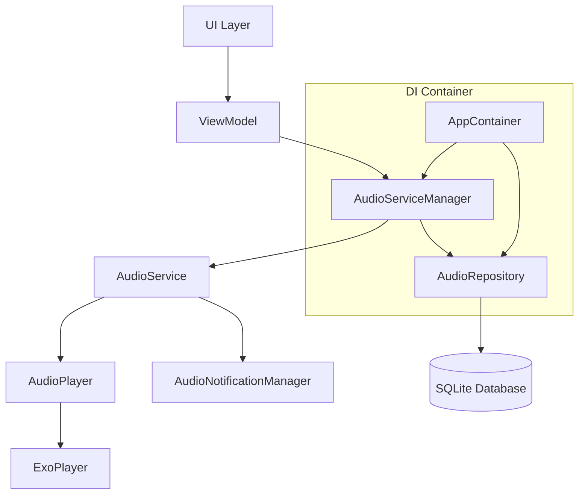
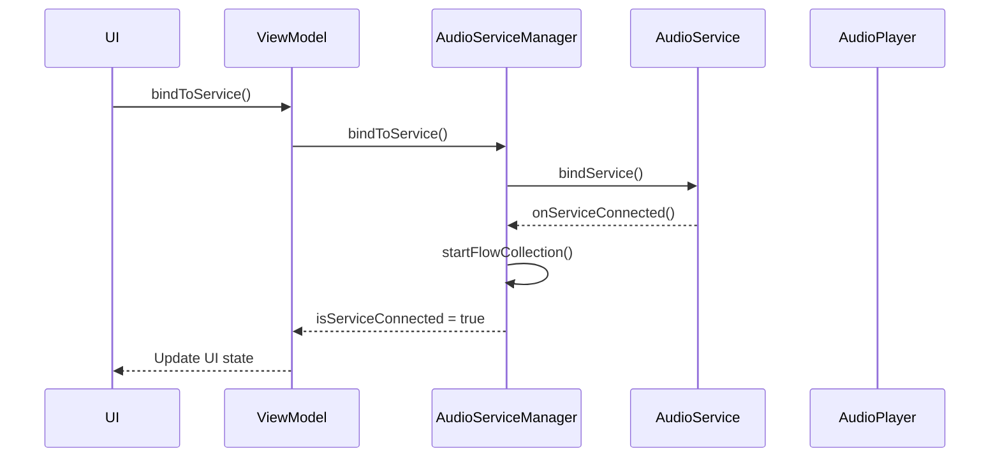
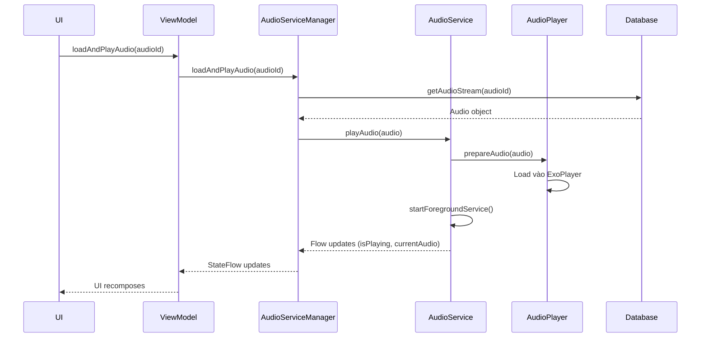
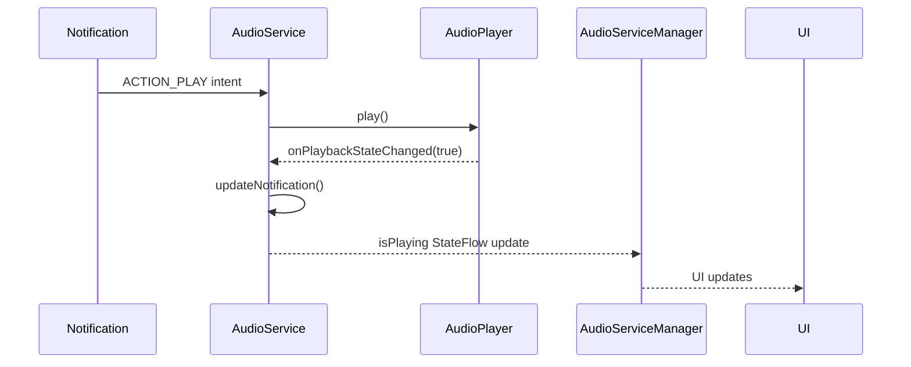

# 🎵 AUDIO SERVICE - COMPLETE GUIDE

## 📋 **MỤC LỤC**
- [Tổng Quan](#tổng-quan)
- [Kiến Trúc](#kiến-trúc)
- [Các Service Components](#các-service-components)
- [Flow Hoạt Động](#flow-hoạt-động)
- [Dependency Injection](#dependency-injection)
- [Hướng Dẫn Test](#hướng-dẫn-test)
- [Tích Hợp Với Chức Năng Khác](#tích-hợp-với-chức-năng-khác)
- [Troubleshooting](#troubleshooting)

---

## 🎯 **TỔNG QUAN**

Audio Service là hệ thống phát nhạc background hoàn chỉnh cho ứng dụng Japanese Listening Trainer, bao gồm:

### **Tính Năng Chính:**
- ✅ **Background Audio Playback** - Phát nhạc khi app bị minimize
- ✅ **Media Notification** - Notification với controls (play/pause/next/previous)
- ✅ **ExoPlayer Integration** - High-quality audio playback
- ✅ **Database Integration** - Lưu favorite, listen times
- ✅ **Playlist Support** - Next/Previous tracks
- ✅ **Shuffle Mode** - Random playback
- ✅ **Seek Controls** - Forward/backward seeking
- ✅ **Real-time UI Updates** - StateFlow reactive programming

---

## 🏗️ **KIẾN TRÚC**



### **Layer Responsibilities:**
- **UI Layer**: Compose screens, user interactions
- **ViewModel**: State management, business logic
- **AudioServiceManager**: Service abstraction, database operations
- **AudioService**: Foreground service, lifecycle management
- **AudioPlayer**: ExoPlayer wrapper, playback control
- **AudioNotificationManager**: Media notification handling

---

## 🔧 **CÁC SERVICE COMPONENTS**

### **1. AudioService.kt**
**Vai trò:** Foreground Service chính
```kotlin
class AudioService : Service(), AudioPlayer.AudioPlayerCallback
```

**Chức năng:**
- ✅ Chạy background service
- ✅ Quản lý AudioPlayer lifecycle
- ✅ Handle service intents (play/pause/next/prev)
- ✅ Manage foreground notification
- ✅ Playlist management với shuffle
- ✅ Position updates mỗi giây

**States exposed:**
```kotlin
val isPlaying: StateFlow<Boolean>
val currentPosition: StateFlow<Long>
val duration: StateFlow<Long>
val currentAudio: StateFlow<Audio?>
```

**Public Methods:**
```kotlin
fun playAudio(audio: Audio)
fun playPlaylist(audioList: List<Audio>, startIndex: Int = 0)
fun togglePlayPause()
fun seekTo(position: Long)
fun nextTrack()
fun previousTrack()
fun toggleShuffle()
```

---

### **2. AudioPlayer.kt**
**Vai trò:** ExoPlayer wrapper
```kotlin
class AudioPlayer(private val context: Context)
```

**Chức năng:**
- ✅ ExoPlayer initialization và configuration
- ✅ Audio loading từ raw resources
- ✅ Playback state management
- ✅ Error handling
- ✅ Resource cleanup

**Audio Loading:**
```kotlin
fun prepareAudio(audio: Audio) {
    val resourceId = context.resources.getIdentifier(
        audio.filePath, "raw", context.packageName
    )
    val uri = Uri.parse("android.resource://${context.packageName}/$resourceId")
    // Load vào ExoPlayer
}
```

---

### **3. AudioServiceManager.kt**
**Vai trò:** Service abstraction layer
```kotlin
class AudioServiceManager(
    private val context: Context,
    private val audioRepository: AudioRepository
)
```

**Chức năng:**
- ✅ Service binding/unbinding
- ✅ Real-time Flow collection từ AudioService
- ✅ Database integration (favorites, listen times)
- ✅ UI-friendly API

**Database Methods:**
```kotlin
suspend fun loadAndPlayAudio(audioId: Int)
suspend fun toggleFavoriteStatus(audio: Audio)
suspend fun incrementListenTimes(audio: Audio)
```

**Flow Collection:**
```kotlin
private fun startFlowCollection() {
    managerScope.launch {
        launch { service.isPlaying.collect { _isPlaying.value = it } }
        launch { service.currentPosition.collect { _currentPosition.value = it } }
        launch { service.duration.collect { _duration.value = it } }
        launch { service.currentAudio.collect { _currentAudio.value = it } }
    }
}
```

---

### **4. AudioNotificationManager.kt**
**Vai trò:** Media notification management
```kotlin
class AudioNotificationManager(private val context: Context)
```

**Chức năng:**
- ✅ Tạo notification channel
- ✅ MediaStyle notification với controls
- ✅ PendingIntent cho notification actions
- ✅ Update notification theo playback state

**Notification Actions:**
```kotlin
private fun createPlayPauseAction(isPlaying: Boolean): NotificationCompat.Action
private fun createNextAction(): NotificationCompat.Action
private fun createPreviousAction(): NotificationCompat.Action
```

---

### **5. MusicPlayerViewModel.kt**
**Vai trò:** UI state management với DI
```kotlin
class MusicPlayerViewModel(
    private val audioServiceManager: AudioServiceManager
) : ViewModel()
```

**Chức năng:**
- ✅ Expose AudioServiceManager states
- ✅ Handle UI actions
- ✅ Loading states management
- ✅ Service lifecycle trong ViewModel

---

## 🔄 **FLOW HOẠT ĐỘNG**

### **1. Khởi Tạo Service Flow**


### **2. Play Audio Flow**


### **3. Notification Control Flow**


---

## 💉 **DEPENDENCY INJECTION**

### **Architecture:**
```kotlin
// AppContainer.kt
interface AppContainer {
    val audioRepository: AudioRepository
    val audioServiceManager: AudioServiceManager // ✅ DI
}

// AppViewModelProvider.kt
initializer {
    MusicPlayerViewModel(
        audioServiceManager = trainerApplication().container.audioServiceManager
    )
}
```

### **Benefits:**
- ✅ **Loose Coupling**: UI không phụ thuộc trực tiếp
- ✅ **Testability**: Dễ mock cho unit tests
- ✅ **Centralized Management**: Quản lý tập trung
- ✅ **Professional Architecture**: Follow Android best practices

---

## 🧪 **HƯỚNG DẪN TEST**

### **1. Setup Test Environment**

#### **Chuẩn Bị:**
1. ✅ Đảm bảo có file audio test trong `app/src/main/res/raw/test_audio.mp3`
2. ✅ Build project thành công
3. ✅ Enable notification permission trên device/emulator

#### **Test Files:**
```
app/src/main/java/com/sun/japaneselisteningtrainer/
├── AudioTest.kt                    # ✅ Simple test screen
└── MainActivity.kt                 # ✅ Launch AudioTest()
```

### **2. Basic Functionality Test**

#### **Test Steps:**
```kotlin
// 1. Launch app
// 2. Tap "Add Test Audio" nếu list trống
// 3. Tap audio item để play
// 4. Test các controls:
//    - Play/Pause button
//    - Next/Previous buttons
//    - Seek bar
//    - Shuffle toggle
//    - Favorite toggle
```

#### **Expected Results:**
- ✅ Audio plays immediately
- ✅ Progress bar updates real-time
- ✅ Controls responsive
- ✅ Notification appears when minimize app
- ✅ Notification controls work
- ✅ Favorite status saves to database
- ✅ Listen times increments

### **3. Notification Test**

#### **Test Steps:**
```kotlin
// 1. Play audio
// 2. Minimize app (press Home button)
// 3. Check notification panel
// 4. Test notification controls:
//    - Play/Pause
//    - Next track
//    - Previous track
// 5. Tap notification to return to app
```

#### **Expected Results:**
- ✅ Notification shows với album art
- ✅ Current track title displays
- ✅ Controls work từ notification
- ✅ Tapping notification returns to app

### **4. Background Playback Test**

#### **Test Steps:**
```kotlin
// 1. Play audio
// 2. Switch to other apps
// 3. Wait 30 seconds
// 4. Return to app
// 5. Check playback position
```

#### **Expected Results:**
- ✅ Audio continues playing in background
- ✅ Position updates correctly
- ✅ UI syncs with actual playback state

### **5. Database Integration Test**

#### **Test Steps:**
```kotlin
// 1. Toggle favorite on/off multiple times
// 2. Play same audio multiple times
// 3. Restart app
// 4. Check favorite status và listen times
```

#### **Expected Results:**
- ✅ Favorite status persists
- ✅ Listen times increments correctly
- ✅ Data survives app restart

---

## 🔗 **TÍCH HỢP VỚI CHỨC NĂNG KHÁC**

### **1. Home Screen Integration**

#### **HomeViewModel Updates:**
```kotlin
class HomeViewModel(
    private val audioRepository: AudioRepository,
    private val audioServiceManager: AudioServiceManager // ✅ Inject
) : ViewModel() {
    
    fun playAudio(audio: Audio) {
        viewModelScope.launch {
            audioServiceManager.playAudio(audio)
        }
    }
    
    // Observe current playing audio
    val currentPlayingAudio = audioServiceManager.currentAudio
}
```

#### **HomeScreen Updates:**
```kotlin
@Composable
fun HomeScreen(
    homeViewModel: HomeViewModel = viewModel(factory = AppViewModelProvider.Factory)
) {
    val currentAudio by homeViewModel.currentPlayingAudio.collectAsState()
    
    // Show mini player nếu có audio đang phát
    currentAudio?.let { audio ->
        MiniAudioPlayer(
            audio = audio,
            onTap = { /* Navigate to full player */ }
        )
    }
}
```

### **2. Search Integration**

#### **Search Results:**
```kotlin
@Composable
fun SearchResultItem(
    audio: Audio,
    onPlay: (Audio) -> Unit
) {
    Row {
        Text(audio.title)
        IconButton(onClick = { onPlay(audio) }) {
            Icon(Icons.Default.PlayArrow, "Play")
        }
    }
}
```

### **3. Playlist Management**

#### **Folder-based Playlists:**
```kotlin
// Play all audios trong folder
suspend fun playFolder(folderId: Int) {
    val audios = audioRepository.getAudiosByFolder(folderId)
    audioServiceManager.playPlaylist(audios)
}

// Play favorite playlist
suspend fun playFavorites() {
    val favorites = audioRepository.getFavoriteAudios()
    audioServiceManager.playPlaylist(favorites)
}
```

### **4. Navigation Integration**

#### **Deep Links:**
```kotlin
// Navigate to player với specific audio
fun navigateToPlayer(audioId: Int) {
    navController.navigate(
        MusicPlayerDestination.createRoute(audioId)
    )
}
```

---

## 🔧 **API REFERENCE**

### **AudioServiceManager Public API:**

#### **Playback Control:**
```kotlin
fun playAudio(audio: Audio)                              // Play single audio
fun playPlaylist(audioList: List<Audio>, startIndex: Int = 0)  // Play playlist
fun togglePlayPause()                                    // Toggle play/pause
fun seekTo(position: Long)                              // Seek to position
fun nextTrack()                                         // Next track
fun previousTrack()                                     // Previous track
fun toggleShuffle()                                     // Toggle shuffle mode
```

#### **Database Operations:**
```kotlin
suspend fun loadAndPlayAudio(audioId: Int)              // Load from DB and play
suspend fun toggleFavoriteStatus(audio: Audio)         // Toggle favorite
suspend fun incrementListenTimes(audio: Audio)         // Increment listen count
```

#### **State Observation:**
```kotlin
val isPlaying: StateFlow<Boolean>                       // Playing state
val currentPosition: StateFlow<Long>                    // Current position (ms)
val duration: StateFlow<Long>                          // Total duration (ms)
val currentAudio: StateFlow<Audio?>                    // Current audio info
val isServiceConnected: StateFlow<Boolean>             // Service connection state
```

#### **Utility Methods:**
```kotlin
fun getProgress(): Float                                // Progress 0.0 to 1.0
fun isCurrentlyPlaying(): Boolean                      // Current playing state
fun getCurrentAudio(): Audio?                          // Current audio info
fun formatTime(milliseconds: Long): String             // Format time MM:SS
```

---

## 🚨 **TROUBLESHOOTING**

### **Common Issues:**

#### **1. Audio không phát được**
```kotlin
// Check:
- File audio có tồn tại trong res/raw/?
- File name match với audio.filePath?
- Permission INTERNET được declare?
```

#### **2. Notification không hiện**
```kotlin
// Check:
- POST_NOTIFICATIONS permission granted?
- Notification channel được tạo?
- Service running foreground?
```

#### **3. UI không update**
```kotlin
// Check:
- Service connected properly?
- Flow collection started?
- StateFlow observed trong Composable?
```

#### **4. Memory leaks**
```kotlin
// Ensure:
- unbindFromService() called trong onDestroy
- CoroutineScope cancelled properly
- ExoPlayer released trong onDestroy
```

### **Debug Commands:**
```bash
# Check running services
adb shell dumpsys activity services | grep AudioService

# Check notifications
adb shell dumpsys notification

# Clear app data
adb shell pm clear com.sun.japaneselisteningtrainer

# Install debug APK
./gradlew installDebug
```

---

## 📱 **PRODUCTION CHECKLIST**

### **Before Release:**
- [ ] ✅ All permissions declared trong AndroidManifest.xml
- [ ] ✅ ProGuard rules for ExoPlayer
- [ ] ✅ Error handling cho network issues
- [ ] ✅ Memory leak testing
- [ ] ✅ Battery optimization testing
- [ ] ✅ Notification channel localization
- [ ] ✅ Audio focus management
- [ ] ✅ Headphone disconnect handling

### **Performance Optimization:**
- [ ] ✅ Lazy loading cho large playlists
- [ ] ✅ Image caching cho album arts
- [ ] ✅ Database query optimization
- [ ] ✅ Background thread cho heavy operations

---

## 🎉 **CONCLUSION**

Audio Service system đã hoàn thiện với:
- ✅ **Professional Architecture** với MVVM + DI
- ✅ **Complete Feature Set** với background playback
- ✅ **Database Integration** với favorites và statistics
- ✅ **Real-time UI Updates** với StateFlow
- ✅ **Easy Integration** với existing features

**Ready for production use!** 🎵✨

---

**Tác giả:** Claude AI Assistant  
**Ngày cập nhật:** $(date)  
**Version:** 1.0.0
